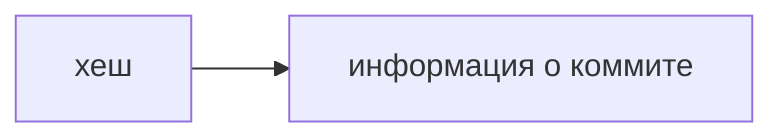

#Основные команды Linux

## Навигация

==pwd== - отобразить текущую директорию (от англ. _**p**rint **w**orking **d**irectory_, «показать рабочую папку»);
==ls== - отобразить содержимое директории (от англ. _**l**i**s**t directory contents_, «отобразить содержимое директории»);
==ls -a== - отобразить скрытые файлы и папки;
==cd== - сменить директорию (от англ. _**c**hange **d**irectory_, «сменить директорию»);
==cd ..== - переход на уровень выше (директории);
==cd .== - переход в текущую директорию;
==cd ~== - переход в домашнюю директорию;
==cd /== - переход в корневую директорию.

## Работа с файлами и папками
### Создание

==touch== - создать файл (англ. _touch,_ «коснуться»), для создания нескольких файлов, нужно написать названия в одну строчку через пробел;
==mkdir== - создать директорию (от англ. _**m**a**k**e **dir**ectory_, «создать директорию»);
==mkdir -p== - создание целой структуры директорий одной командой.

### Копирование и перемещение

==cp== - копирование файлов (от англ. _**c**o**p**y_, «копировать»);
==clip== < ~/.ssh/id_rsa.pub - скопировать содержимое;
==mv== - перемещение файлов (от англ. _**m**o**v**e_, «переместить»).

### Чтение
==cat== - вывести содержимое файла (от англ. _con**cat**enate and print_, «объединить и распечатать»).

### Удаление

==rm== - удалить файл (от англ. _**r**e**m**ove_, «удалить»);
==rmdir== - удалить директорию (от англ. _**r**e**m**ove **dir**ectory_, «удалить директорию»);
==rm -r== - удалить директорию с файлами (от англ. _**r**e**m**ove,_ «удалить» + _**r**ecursive_, «рекурсивный»).

### Полезные возможности

==&&== - исполнение нескольких команд сразу.
==Tab== - предложит несколько вариантов продолжения команды.
==/== и ==~== - можно быстро перемещаться к корневой и домашней директориям.

#Основные команды Git

==git init== - сделать папку репозиторием (от англ. _repository_ — «хранилище»);
==git stasus== - проверить состояние репозитория;

Чтобы разгитить папку, нужно удалить скрытую папку .git.

==git add== - подготовить файлы к сохранению;
==git add --all== - подготовить файл к сохранению (от англ. _add_ — «добавить» + от англ. _all_ — «всё»);
==git add .== - добавить в репозиторий текущую папку со всеми файлами;

==git commit== - выполнить коммит;
==git commit -m== - ключ позволяет присвоить коммиту сообщение (от англ. _**m**essage_ — «сообщение»);
==git remote -v== - убедиться, что репозитории связаны;
==-v== - короткая форма флага `--verbose` (англ. «подробный»);

==git push -u origin main== - вызывается в первый раз;
==git push== - отправить изменения на удалённый репозиторий (от англ. _push_ — «толкать»);

==git log== - посмотреть историю коммитов (от англ. _log_ — «журнал записей»);

==ssh -T git@github.com ==== - Проверить правильность ключа;

__Хеширование__ (от англ. hash, "рубить", "крошить", "мешанина") - это способ преобразовать набор данных и получить их ==отпечаток== (англ. fingerprint).

Информация о коммите - это набор данных: когда был сделан коммит, содержимое файлов в репозитории на момент коммита и ссылка на предыдущий, или __родительский__ (англ. parent), коммит. 

Git хеширует (преобразует) информацию о коммите с помощью алгоритма SHA-1 (от англ. Secure Hash Algorithm - "безопасный алгоритм хеширования") и получает для каждого коммита свой уникальный __хеш__ - результат хеширования.

## Хеш - основной идентификатор коммита
Git хранит таблицу соответствий 

Если вы знаете хеш, вы можете узнать всё остальное: автора и дату коммита и содержимое закоммиченных файлов. Можно сказать, что хеш - основной идентификатор коммита. 

Все хеши, а также таблицу соответствий

Git хранит в папке ==.git==.
